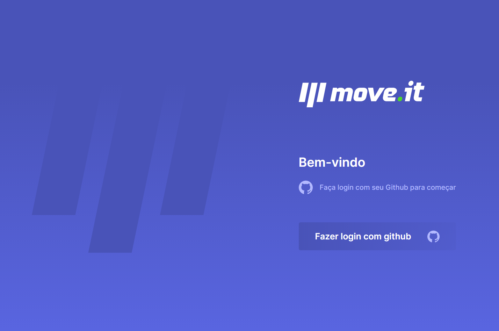
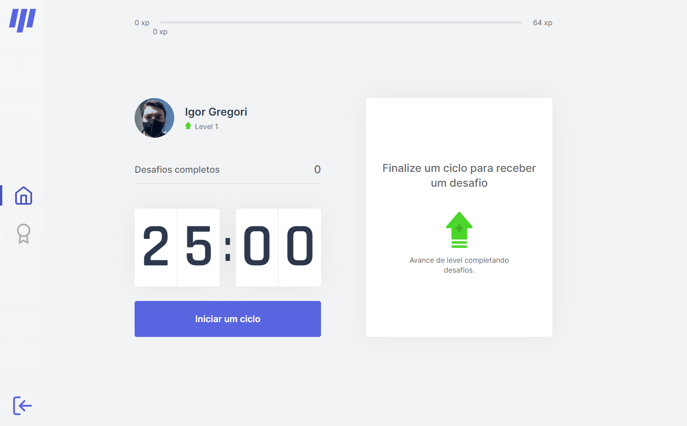
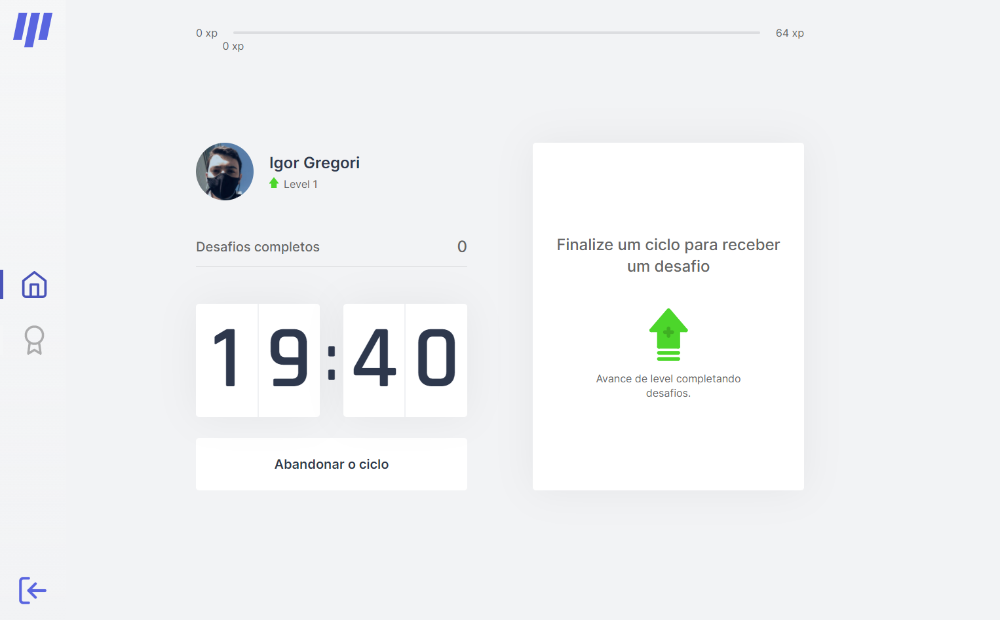
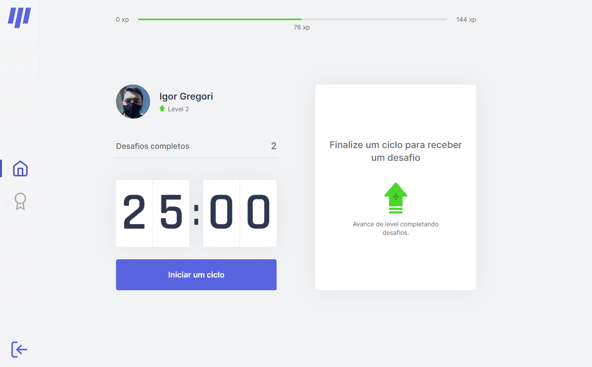
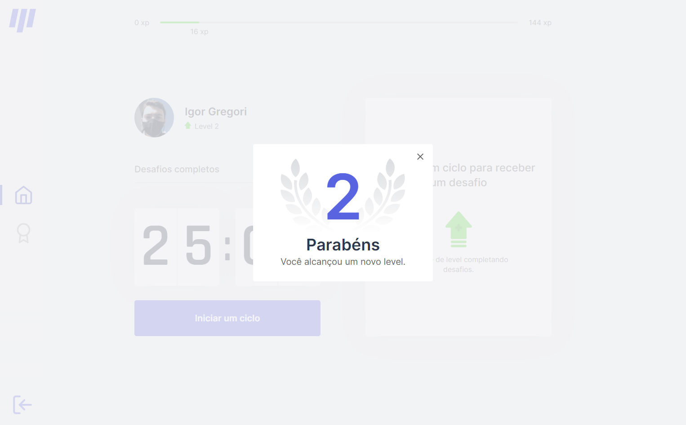
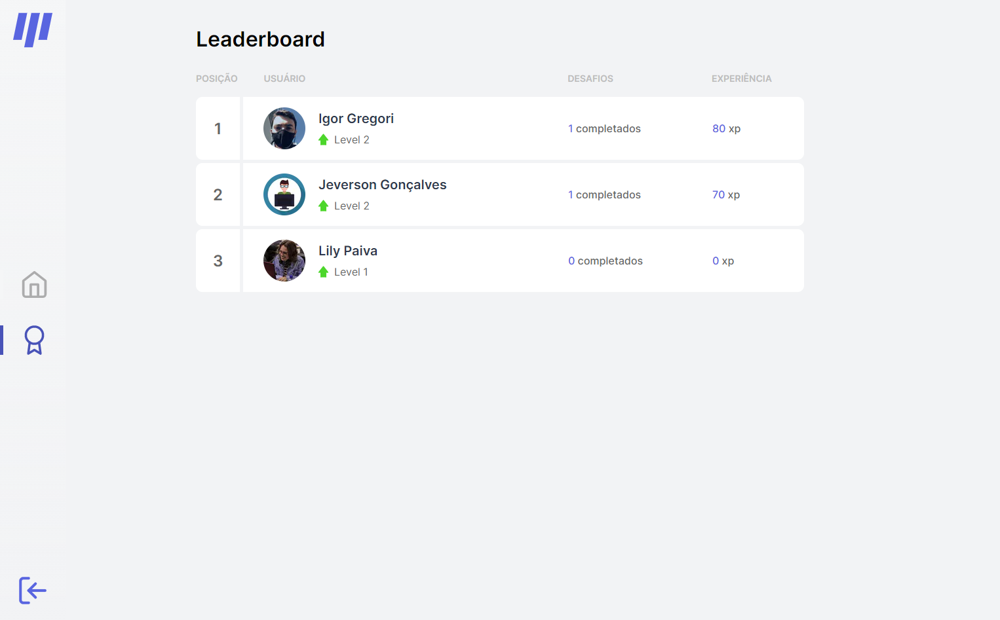

<h1 align="center">
  
  <br />
  <p align="center">
     <a href="https://moveit-igor-gregori.vercel.app/">https://moveit-igor-gregori.vercel.app/</a>
  <p/>
  <br />
  <a href="https://www.linkedin.com/in/igor-gregori-362a1b20a/">
    
  </a>
  <a href="https://github.com/Igor-Gregori/moveit/blob/main/LICENSE">
    
  </a>
  <a href="https://github.com/Igor-Gregori/moveit/issues">
    
  </a>
  <a href="https://github.com/Igor-Gregori/moveit/issues?q=is%3Aissue+is%3Aclosed">
    
  </a>
  <a href="https://github.com/Igor-Gregori/moveit/stargazers">
    
  </a>
  <a href="https://github.com/Igor-Gregori/moveit/network">
    
  </a>
</h1>

<p align="center">
  <a href="#page_facing_up-descrição">Descrição</a>&nbsp;&nbsp;&nbsp;|&nbsp;&nbsp;&nbsp;
  <a href="#art-Layout">Layout</a>&nbsp;&nbsp;&nbsp;|&nbsp;&nbsp;&nbsp;
  <a href="#-tecnologias">Tecnologias</a>&nbsp;&nbsp;&nbsp;|&nbsp;&nbsp;&nbsp;
  <a href="#clipboard-Funcionalidades">Funcionalidades</a>&nbsp;&nbsp;&nbsp;|&nbsp;&nbsp;&nbsp;
  <a href="#computer-instalação">Instalação</a>&nbsp;&nbsp;&nbsp;|&nbsp;&nbsp;&nbsp;
  <a href="#man-Desenvolvedor">Autor</a>&nbsp;&nbsp;&nbsp;|&nbsp;&nbsp;&nbsp;
  <a href="#closed_book-Licença MIT">Licença</a>
</p>

<p align="center">
  <div class="rounded-1">
     
  </div>
  
  
  
  
  
  
</p>

## :page_facing_up: Descrição

O aplicativo Move.it utiliza a técnica Pomodoro para que as pessoas que passam muito tempo em frente a telas de computador possam se exercitar minimamente e controladamente.

## :art: Layout

Você pode acessar o Layout de base pelo <a href="https://www.figma.com">Figma<a> por meio <a href="https://www.figma.com/file/ZIzDXbcUgI6b9HRVA9wKYQ/Move.it-2.0-(Copy)">desse link<a>.

## 🛠 Tecnologias

Este projeto foi desenvolvido com as seguintes tecnologias

- [Next.js](https://nextjs.org/)
- [React.js](https://pt-br.reactjs.org/)
- [TypeScript](https://www.typescriptlang.org/)
- [MongoDB](https://docs.mongodb.com/)
- [Firebase](https://firebase.google.com/docs?hl=pt-br)
- [Axios](https://www.npmjs.com/package/axios)
- [Serverless Functions](https://vercel.com/docs/serverless-functions/introduction)
- [CSS Modules Stylesheet](https://create-react-app.dev/docs/adding-a-css-modules-stylesheet/)
- Para mais detalhes, veja o <kbd>[package.json](./package.json)</kbd>

## :clipboard: Funcionalidades

- [x] Fazer cadastro e autenticação pelo GitHub.
- [x] Tabela de pontuação.
- [x] Iniciar um ciclo de 25 minutos.
- [x] Abandonar ciclo.
- [x] Efeitos sonoros quando o ciclo chega ao fim.
- [x] Notificação Browser quando o ciclo chega ao fim.
- [x] Novos desafios a cada ciclo.
- [x] Usuário ganha XP a cada desafio concluído.
- [x] Usuário sobe seu level ganhando XP nos desafios.
- [x] Quanto maior o level e o XP do usuário melhor é a posição dele no ranking.

## :computer: Instalação

### Pré-requisitos

Antes de começar, você vai precisar ter instalado em sua máquina as seguintes ferramentas:
[Git](https://git-scm.com), [Node.js](https://nodejs.org/en/), Além disto é bom ter um editor para trabalhar com o código como [VSCode](https://code.visualstudio.com/)

```bash
# Clone este repositório.
$ git clone https://github.com/Igor-Gregori/moveit

# Vá para a pasta moveit
$ cd moveit

# Instale as dependências
$ npm install

# Execute aplicação
$ npm run dev

# O app vai está rodando na porta 3000 - acesse <http://localhost:3000>
http://localhost:3000
```

### Configurações Adicionais

```bash
# Você pode ter controle de acesso e autenticação usando a sua chave do Firebase, trocando a const firebaseConfig em /src/configs/firebase-config.tsx

# Você pode ter controle do banco de dados usando a sua chave do MongoDB, trocando a constante MONGODB_URI no arquivo raiz .env
```

## :man: Desenvolvedor

<a href="https://github.com/Igor-Gregori">
 
 <br />
 <sub><b>Igor Gregori</b></sub>
</a>

Desenvolvido por <b>Igor Gregori</b> :metal::satisfied::+1: Entre em contato! :speech_balloon:

<a href="https://www.linkedin.com/in/igor-gregori-362a1b20a/">
  
</a>

## :closed_book: Licença MIT

This project is [MIT](https://github.com/Igor-Gregori/moveit/blob/main/LICENSE) licensed.
